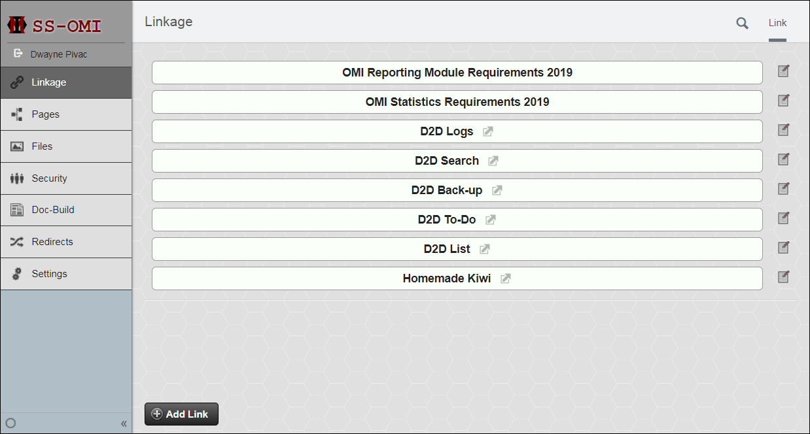

# Linkage
Linkage add-on for SilverStripe 4 (WIP!)

## Introduction

Linkage is a very simple landing page SilverStripe add-on.

It provides a place to add links that appear on the CMS landing page, in place of the default "Pages", using the built in GridField.

*ScreenShot from SilverStripe 3.1.10*

*ScreenShot from SilverStripe 3.5.3 with a custom OMI Ltd. theme*

Note: This is early days and the add-on is NOT all that 'flash' at the mo.

Feel free to comment with ideas!

## Requirements

SilverStripe Framework 3.0+

(No SilverStripe4 version available .... yet)

## Installation

Please follow the [standard module installation documentation](https://docs.silverstripe.org/en/3/developer_guides/extending/modules/)

The module should reside in a top-level directory called `linkage/`

Don't forget, no matter how you choose to install, once done you must build and flush `/dev/build?flush=all`

### Manual
- Download the latest (v1.0.0) version on Linkage
- Unzip in the root directory of your project (that should be where all your SilverStripe files are (cms,framework,reports etc))
- rename the Linkage directory to "linkage"
- perform a little dance

### Composer
`composer require sirjeff/linkage 1.0.0`

or if you don't have Composer you can download composer.phar and then run:

`php composer.phar require sirjeff/linkage 1.0.0`

## Issues
There is a problem in the way the module holds focus in the CMS. I'm looking at this now ... it might mean that I cannot have the page the landing by default without the user having to modify their _config.yml file
Please use the [issues](/sirjeff/linkage/issues) link to add any bungness you find, or check to see what's going on in the funky functions world.

## The Future...
- Nicer look'n'feel
- Settings such as 'Don't be default landing' or 'x Links per page'
- Proper link adding. Currently they be text fields. Would prefer something more 'URL-esque'
- Import and Export
- URL test when adding a link

## Maintainers

Dwayne &lt;dwayne at omi dot nz&gt;

OMI Ltd. &lt;adm at omi dot nz&gt;
